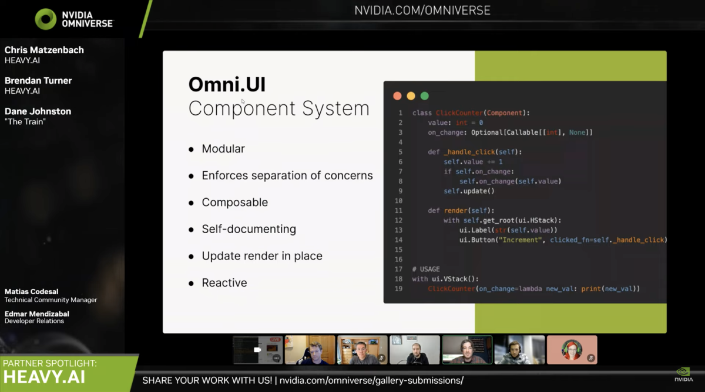

# HEAVY.AI | Omni.Ui Component System

This component system was first presented during a NVIDIA Partner Spotlight with HEAVY.AI and can be found [here on YouTube](https://youtu.be/QhBMgx2G86g?t=1640)



## Goals

1. Provide a means to encapsulate functions and  `omni.ui`  widgets to modularize UI code by its purpose to enforce boundaries using separation of concerns
2. Standardize the creation and implementation of UI components in a manner that enforces self-documentation and a homogenous UI codebase
3. Provide the utility of updating and re-rendering specific components without re-rendering components that have not changed


## Examples

### Hello World

```python
from heavyai.ui.component import Component

class SimpleLabel(Component):
    def render(self):
        ui.Label("Hello World")

# USAGE
SimpleLabel()

class CustomLabel(Component):
    value: str = "Hello World"

    def render(self):
        ui.Label(self.value)

# USAGE
CustomLabel(value="Hello There")
```

### Internal State

```python
from heavyai.ui.component import Component

class ButtonCounter(Component):
    value: int = 0
    on_change: Optional[Callable[[int], None]]

    def _handle_click(self):
        self.value += 1
        if self.on_change:
            self.on_change(self.value)
        self.update()

    def render(self):
        with self.get_root(ui.HStack):
            ui.Label(str(self.value))
            ui.Button("Increment", clicked_fn=self._handle_click()

# USAGE
ButtonCounter(on_change=lambda val: print(val))
```

### Subscribing Components

```python
from heavyai.ui.component import Component

class UsdSubscribingComponent(Component):
    prim: pxr.Usd.Prim

    def __init__(self, **kwargs):
        super().__init__(**kwargs)

        self.subscription: carb.Subscription = (
            usd.get_watcher().subscribe_to_change_info_path(
                path=self.prim.GetPath(), on_change=self._handle_prim_change
            )
        )

    def _handle_prim_change(self, prim_attr_path):
        self.update()

    def render(self):
        with self.get_root(ui.VStack):
            pass

    def destroy(self):
        self.subscription.unsubscribe()


class AbstractModelSubscribingComponent(Component):
    model: sc.AbstractManipulatorModel

    def __init__(self, **kwargs):
        super().__init__(**kwargs)

        self.subscription: carb.Subscription = (
            self.model.subscribe_item_changed_fn(
                self._handle_model_item_changed
            )
        )

    def _handle_model_item_changed(self, model, item):
        self.update()

    def render(self):
        with self.get_root(ui.VStack):
            pass

    def destroy(self):
        self.subscription.unsubscribe()
```

## Re-rendering “In Place”

Similar to the ability to update the `style` property of any  `ui.Widget` element or the `text` property of `ui.Label` and `ui.Button` elements, `Components` can also be updated after they are created.  Components can update themselves in response to subscribed events or user interactions, or components can be updated elsewhere via reference. This *drastically* increases the composability of UI elements.

### Using Setters

```python
class CustomLabel(Component):
    value: str = "Hello World"

    def set_value(self, value: str):
        self.value = value
        self.update()

    def render(self):
        ui.Label(self.value)

hello_world_label = CustomLabel()
hello_world_label.set_value(
    "Goodbye, and see you later"
)
```

### Using a Reference

```python
hello_world_label = CustomLabel()

hello_world_label.value = "Goodbye, and see you later"
hello_world_label.update()
```

## Caveat: Destroying a Component

Components are not automatically deleted when cleared from a container (or should otherwise be destroyed), so if a `destroy()` method is provided, a reference to that component must be stored and destroyed by the component’s “parent” when appropriate, resulting in a chain of saved references and destroy calls. This is often the case when a component sets up a subscription; the subscription must be unsubscribed when the component is removed. See 'Subscribing Components' above for examples of components that require a `destroy` method.

```python
class ParentComponent(Component):
    def render(self):
        prim = # get prim reference

        with self.get_root(ui.VStack):
            self.child = UsdSubscribingComponent(
                prim=prim
            )

    def destroy(self):
        self.child.destroy()
```
